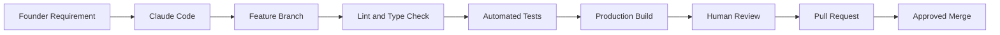

<div align="center">

# Hi, I'm Sandeep 👋

### Founder of KAVIXO

**AI Automation • Education Technology • Cross-Platform Products**

Building an intelligent education and career ecosystem for adult learners,  
competitive-exam aspirants, professionals, and job seekers.

[](https://kavixo.in)


</div>

---

## 🚀 Current Mission

I am building **KAVIXO**, an AI-powered education, competitive-examination, professional-skills, and career platform for users aged 18 and above.

KAVIXO is being designed as one connected ecosystem across:

- Web
- Android
- iOS
- AI-assisted learning
- Competitive examinations
- Professional skills
- Mock tests and performance analytics
- Career preparation
- Business automation

---

## 🛰️ KAVIXO Mission Control

| System | Current status |
|---|---|
| Monorepo foundation | ✅ Completed and merged |
| Next.js website | ✅ Foundation ready |
| Expo Android and iOS app | ✅ Foundation ready |
| Shared TypeScript packages | ✅ Ready |
| Supabase foundation | ✅ Ready |
| Adult authentication | 🚧 In development |
| Course catalogue | ⏳ Next |
| First paid category | ⏳ Decision pending |
| Question bank | ⏳ Planned |
| Mock-test engine | ⏳ Planned |
| Progress analytics | ⏳ Planned |
| AI Tutor | ⏳ Planned |
| Payments | ⏳ Planned |
| n8n automation control room | ⏳ Planned |
| Production launch | 🔒 Not deployed |

> Every feature is developed through separate branches, automated checks, human review, and verified GitHub pull requests.

---

## 🤖 Development Workflow



---

## 🧠 AI Automation Mission

The long-term KAVIXO operating system will connect:

- **Claude Code** for software development
- **ChatGPT** for planning and quality review
- **Gemini** for visual and media workflows
- **n8n** for workflow orchestration
- **Supabase** for database and authentication
- **GitHub** for version control and approvals
- **Vercel** for web deployment
- **Expo** for Android and iOS delivery

Automation handles repetitive labour.

Human approval remains mandatory for:

- Educational-content publication
- Production deployment
- Payments and refunds
- External marketing
- Security-sensitive changes
- Official examination information

---

## 🛠️ Technology Stack

### Product Development


### Backend and Automation


### AI Systems


---

## 🎯 Product Principles

- Build one verified feature at a time
- Never publish placeholder work
- Automate labour, not accountability
- Keep sensitive actions human-approved
- Protect user information
- Use official sources for changing examination information
- Test before merging
- Measure progress using evidence
- Never claim completion without verification

---

## 📍 Current Development Sequence

```text
Foundation
→ Adult Authentication
→ Neutral Course Catalogue
→ First Paid Category
→ Lessons and Question Bank
→ Mock Tests
→ Progress Analytics
→ AI Tutor
→ Payments
→ Android and iOS Release
```

---

## 🏢 Projects

### KAVIXO

An adult education, competitive-examination, professional-skills, and career ecosystem.

- **Status:** Private development
- **Domain:** kavixo.in
- **Audience:** Users aged 18 and above
- **Operator:** Sunny AI Solutions

### Sunny AI Solutions

AI automation, websites, applications, business workflows, digital products, and technology services.

---

## 📊 Engineering Standards

Every production feature should include:

- Separate Git branch
- Clear acceptance criteria
- Lint checks
- Type checking
- Automated tests
- Web production build
- Mobile compatibility checks
- Security review
- Human approval
- Pull request
- Rollback instructions

---

## 🌍 Initial Focus

KAVIXO is initially focused on adult learners and job aspirants in:

- Andhra Pradesh
- Telangana
- India

The architecture is intended for future national and multilingual expansion.

---

## 🔐 Development Integrity

KAVIXO does not claim:

- Fake user numbers
- Fake revenue
- Unbuilt features
- Guaranteed jobs
- Guaranteed examination ranks
- Unattended publication of sensitive content

Progress shown here represents completed and verified engineering milestones.

---

<div align="center">

### Building KAVIXO one verified milestone at a time.

**Learn • Prepare • Advance**

</div>
