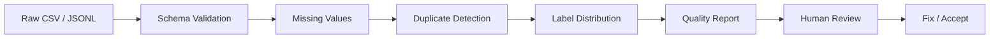

# AI Data Quality & Evaluation Pipeline

A working dataset quality-control tool for AI/ML and annotation workflows.

## 🖼️ Process



## What problem it solves

Before training, evaluation, or annotation handoff, bad records can create misleading results. This project turns common data defects into a repeatable inspection step.

## How it works

1. Load the source dataset.
2. Validate the required schema: `id`, `text`, `label`.
3. Count missing values.
4. Detect duplicate IDs and duplicate text.
5. Calculate label distribution.
6. Print a quality report.
7. Review and fix affected records before downstream AI work.

## ▶ Run it

```bash
python pipeline.py sample_data.csv
```

Included data contains detectable defects so the pipeline can be verified.

### Example result

```text
AI DATA QUALITY REPORT
========================
Rows: 6
Duplicate IDs: 1
Duplicate text: 1
Missing fields: {'id': 0, 'text': 1, 'label': 0}
Label distribution: {'password_reset': 2, 'delivery': 4}
```

## 🧪 Automated tests

```bash
python -m pytest tests/
```

The tests verify that duplicate and missing-value defects are actually detected.

## Skills demonstrated

**Python · AI/ML Data Preparation · Dataset QA · Annotation QA · Data Validation · Error Analysis · Automation · Testing**

## Scope

This is a functioning portfolio implementation, not a claim of an enterprise production platform. The next extension would be JSONL/Parquet ingestion, configurable schemas, severity thresholds, CI quality gates, and human review queues.
