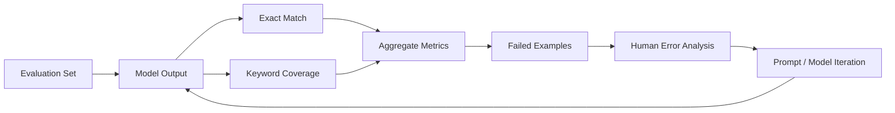

# AI Model Evaluation Lab

A working, explainable evaluation harness for comparing model answers against expected answers.

## 🖼️ Evaluation process



## Real evaluation workflow

1. Create a versioned evaluation set.
2. Store expected answers and candidate model outputs.
3. Run deterministic scoring.
4. Calculate aggregate metrics.
5. Inspect failed examples.
6. Change the model, prompt, or preprocessing.
7. Run the same evaluation set again and compare results.

## ▶ Run it

```bash
python evaluate.py evaluations.jsonl
```

The repository includes four evaluation records, including an intentional incorrect answer so the failure path is visible.

### Example result

```json
{
  "examples": 4,
  "exact_match_rate": 0.75,
  "mean_keyword_coverage": 0.75
}
```

## 🧪 Tests

```bash
python -m pytest tests/
```

## Why this matters

A model demo can show one impressive answer. An evaluation system measures a defined set repeatedly and makes failures inspectable.

## Important scope

This is a working evaluation foundation, not a claim of production-grade LLM benchmarking. Production evaluation should add task-specific rubrics, safety tests, multilingual datasets, hallucination checks, human ratings, versioned prompts/models, and statistical analysis.

## Skills demonstrated

**Python · Generative AI · LLM Evaluation · Experiment Design · Error Analysis · Automation · Testing**
