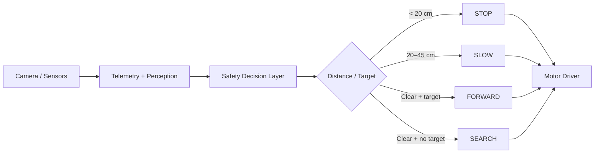

# Autonomous Wheeled Robot — Control Core

A working, hardware-independent autonomy layer for a Raspberry Pi-class wheeled robot. It implements safety-first motion decisions from distance telemetry and perception state.

## 🖼️ Control architecture



## Engineering problem

Robot control logic should be testable before motors are connected. This project separates the decision layer from hardware drivers so safety behaviour can be verified deterministically.

## Current implementation

- Invalid telemetry → **STOP**
- Obstacle closer than 20 cm → **STOP**
- Obstacle between 20–45 cm → **SLOW**
- Clear path + target visible → **FORWARD**
- Clear path + no target → **SEARCH**

## ▶ Run

```bash
python robot_logic.py
```

## 🧪 Automated tests

```bash
python -m pytest tests/
```

Tests cover obstacle stopping, slow mode, and target-search behaviour.

## Hardware integration path

Real Raspberry Pi camera, ultrasonic, and motor-controller adapters can feed telemetry into the same tested decision function. Hardware-specific code stays outside the decision layer.

## Honest scope

This repository contains a tested control core and architecture. It does not claim that a physical robot is autonomously operating from this repository alone.

## Skills demonstrated

**Python · Robotics · Autonomous Systems · Sensor Logic · Safety Engineering · Raspberry Pi Architecture · Testing**
